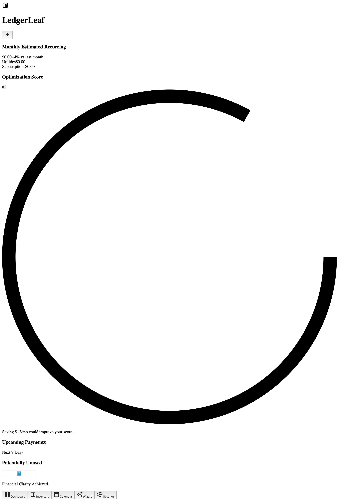
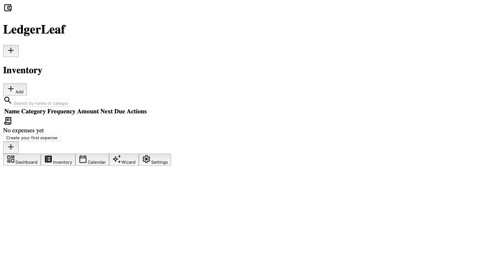
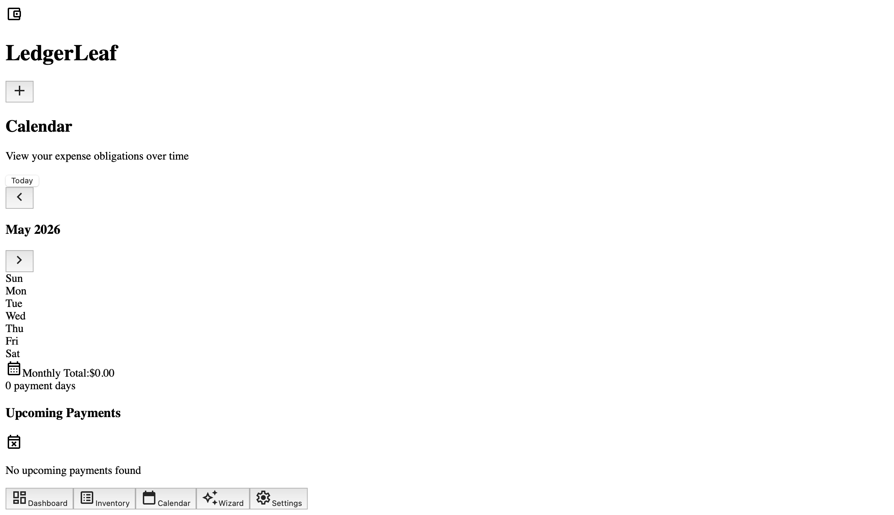
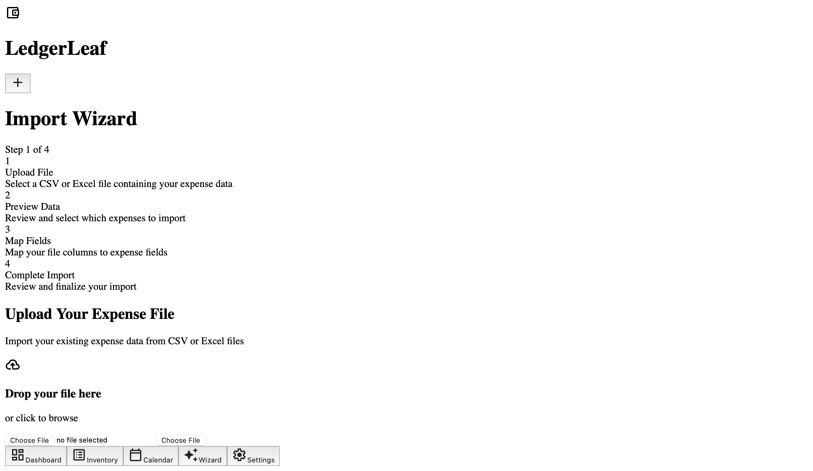
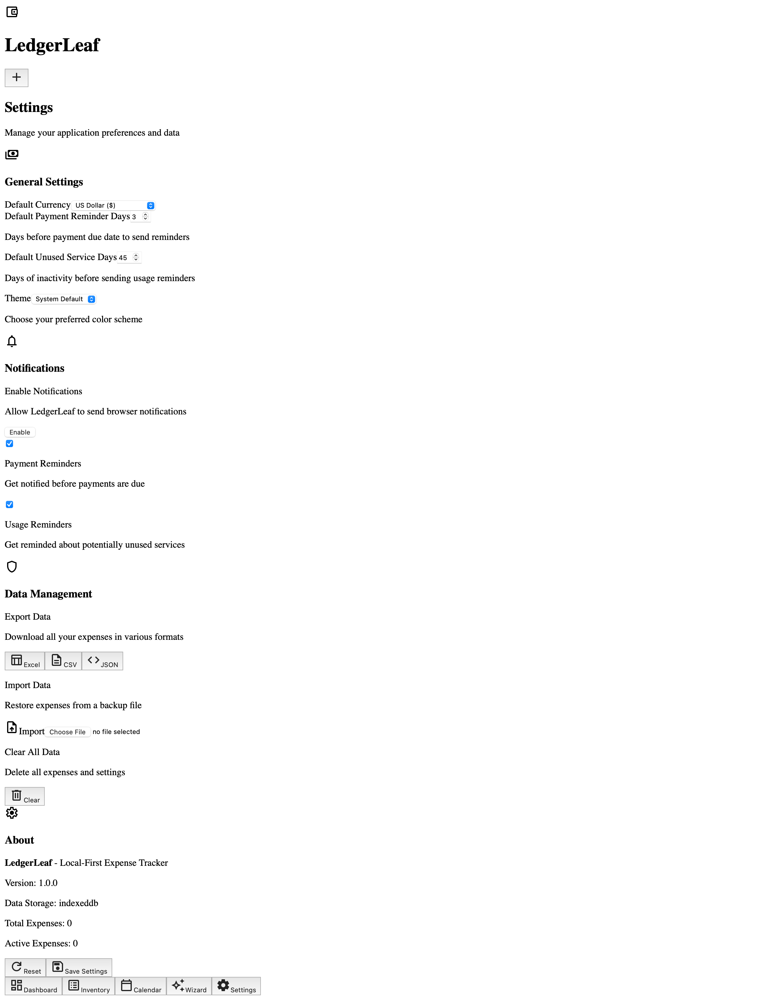

# LedgerLeaf

A fully local-first recurring expenses and obligations management application built as a Progressive Web App with React and TypeScript.

## Features

- **Local-First**: All data stored locally in human-readable YAML files
- **Offline-First**: Works entirely offline without any backend dependencies
- **Desktop App**: Installable Progressive Web App with native filesystem access
- **Expense Tracking**: Track recurring subscriptions, services, and obligations
- **Smart Reminders**: Local notifications for upcoming payments and unused services
- **Dashboard**: Overview of monthly recurring costs, upcoming payments, and category breakdowns
- **Import/Export**: Support for CSV and Excel spreadsheet formats
- **Usage Tracking**: Identify potentially unused subscriptions

## Screenshots

### Dashboard


### Inventory


### Calendar


### Import Wizard


### Settings


## Architecture

### Tech Stack
- **Frontend**: React with TypeScript
- **Build Tool**: Vite
- **Styling**: TailwindCSS
- **Runtime**: Progressive Web App (PWA)
- **State Management**: Zustand
- **Validation**: Zod schemas
- **Storage**: YAML files via File System Access API
- **Date Handling**: date-fns
- **Spreadsheet Support**: SheetJS

### Data Storage
- Expenses stored as individual YAML files in `app-data/expenses/`
- Human-readable and editable format
- Configuration stored in `app-data/config.yml`
- Export functionality for CSV and Excel formats

## Development

### Prerequisites
- Node.js (v18 or higher)

### Getting Started

1. Clone the repository:
```bash
git clone https://github.com/FranekJemiolo/LedgerLeaf.git
cd LedgerLeaf
```

2. Install dependencies:
```bash
npm install
```

3. Run the development server:
```bash
npm run dev
```

### Building

To build the application for production:

```bash
npm run build
```

### Implementation Status

📋 **Implementation Plan**: See [docs/IMPLEMENTATION_PLAN.md](./docs/IMPLEMENTATION_PLAN.md) for detailed implementation status and roadmap.

✅ **Completed**: Core expense management, dashboard, calendar, basic notifications
🚧 **In Progress**: PWA implementation, filesystem storage, import/export completion
📅 **Planned**: Settings panel, advanced filtering, enhanced features

## Project Structure

```
src/
├── features/           # Feature modules
│   ├── dashboard/      # Dashboard component
│   ├── expenses/       # Expense management
│   ├── calendar/       # Calendar view
│   ├── import/         # Import functionality
│   └── settings/       # Settings panel
├── lib/               # Shared utilities
│   └── store.ts        # Zustand state management
├── storage/           # Data persistence layer
│   └── index.ts        # YAML filesystem service
├── types/             # TypeScript types
│   └── index.ts        # Core schemas and interfaces
└── components/        # Reusable UI components
```

## Data Model

Each expense is stored as a YAML file with the following structure:

```yaml
id: netflix
name: Netflix
type: subscription
status: active
cost:
  amount: 59
  currency: PLN
billing:
  frequency: monthly
  interval: 1
  due_day: 14
category:
  - entertainment
  - streaming
reminders:
  enabled: true
  days_before: 3
usage_tracking:
  enabled: true
  last_confirmed_use: 2026-05-01
  remind_after_days_unused: 45
metadata:
  created_at: 2026-05-12
  updated_at: 2026-05-12
notes: |
  Shared family account.
tags:
  - recurring
  - digital
```

## Contributing

1. Fork the repository
2. Create a feature branch
3. Make your changes
4. Test thoroughly
5. Submit a pull request

## License

This project is open source and available under the MIT License.

## Recommended IDE Setup

- [VS Code](https://code.visualstudio.com/) with ES7+ React/Redux/React-Native snippets and PWA tools
